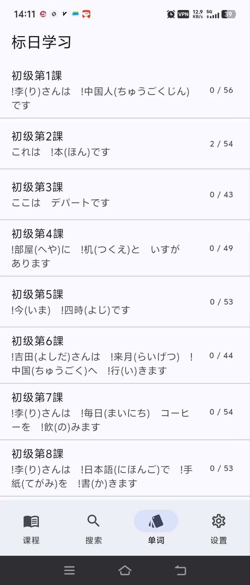
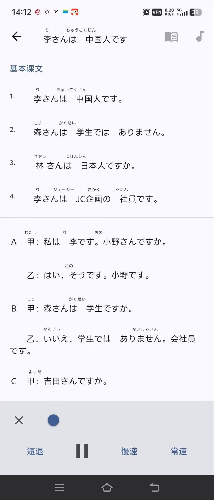

# 标日学习（Flutter 安卓客户端）

基于开源项目 **[冰河标日学习日志](https://github.com/wizicer/LearnJapan)**（《新版中日交流标准日本语》学习笔记、单词与语法）的 **Flutter 安卓应用**。将课文数据与朗读音频打包进应用，便于离线学习。

**English README: [README.md](README.md)**

---

## 功能概览

- **课程** — 初级 / 中级课文，支持假名标注 `!汉字(かな)` 与重音标记 `@`，以 HTML 形式渲染。
- **搜索** — 在本地数据中搜索单词与语法说明。
- **单词** — 按课背单词（翻卡），可选用系统日语 **TTS** 朗读（`flutter_tts`）。
- **学习记录** — 「已记住」单词保存在本机（`SharedPreferences`）；设置页支持 **JSON 导出 / 导入**。
- **音频** — 课文与单词 MP3 来自上游仓库的 **gh-pages** 分支，应用内使用 **just_audio** 播放；资源位于 `assets/audio/`。

---

## 环境要求

- **Flutter** stable（与 `pubspec.yaml` 中 SDK 约束一致，当前为 ^3.11.1）
- **Dart**（随 Flutter 安装）
- **Android SDK**（本工程创建时仅启用 **Android** 平台；若需 iOS 可自行执行 `flutter create .` 补全）

---

## 快速开始

```bash
cd learn_japan_flutter
flutter pub get
```

### 1）生成课程数据（当你修改父目录 `_data/` 下的教材数据时）

在 `learn_japan_flutter/` 目录执行：

```bash
dart run tool/build_data.dart
```

会读取上一级仓库中的 `../_data/*.yml`、`../_data/*.csv`，生成 `assets/data/lessons_bundle.json`。

### 2）下载并打包音频（发布前建议执行）

```bash
dart run tool/fetch_audio.dart
```

从  
`https://raw.githubusercontent.com/wizicer/LearnJapan/gh-pages/assets/audio/`  
下载到 `assets/audio/lesson/` 与 `assets/audio/word/`。  
若需覆盖已有文件，可加参数：`dart run tool/fetch_audio.dart --force`。  
音频总体积约 **80MB 量级**，会明显增加 APK 体积。

### 3）运行调试

```bash
flutter run
```

### 4）打包 APK

```bash
flutter build apk
```

产物位于 `build/app/outputs/flutter-apk/`，其中 **`app-release.apk`** 为发布构建；若曾执行 debug 构建，同目录还可能有 **`app-debug.apk`**。`.sha1` 文件为校验和，不是安装包。

---

## 目录结构说明

| 路径 | 说明 |
|------|------|
| `lib/main.dart` | 入口与底部导航（课程 / 搜索 / 单词 / 设置） |
| `lib/lesson_repository.dart` | 加载并格式化 `lessons_bundle.json`（逻辑对齐原 Ionic `items`） |
| `lib/japan_ruby.dart` | 假名标注与重音 → HTML（规则与原版 JS 一致） |
| `lib/pages/` | 各页面：课程列表、详情、搜索、背诵、设置 |
| `lib/pages/lesson_detail_shell.dart` | 课程详情页音频条（课文 / 单词播放） |
| `assets/data/lessons_bundle.json` | 构建生成的教材数据 |
| `assets/audio/lesson/`、`assets/audio/word/` | MP3，文件名为 `{okey}.mp3`（如 `l1`、`m12`，**l 为字母不是数字 1**） |
| `tool/build_data.dart` | 从 Jekyll `_data` 生成 `lessons_bundle.json` |
| `tool/fetch_audio.dart` | 从 GitHub `gh-pages` 拉取 MP3 |

应用界面截图（缩略预览，原图见 [`说明/`](说明/) 目录）：






---

## 上游项目与许可

- **教材数据与原始站点**：[wizicer/LearnJapan](https://github.com/wizicer/LearnJapan)。  
- **音频**：`fetch_audio.dart` 使用的文件与上游 `gh-pages` 站点一致。  
- 上游为 **MIT License**；若二次分发请保留原作者版权与许可说明。

---


## 贡献

欢迎 Issue 与 PR；请尽量保持改动范围小、风格与现有代码一致。
