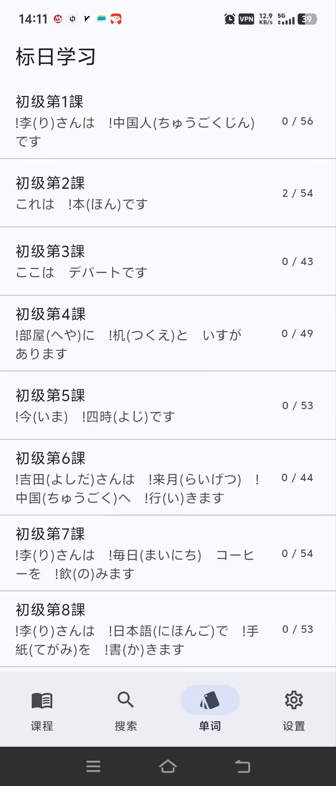
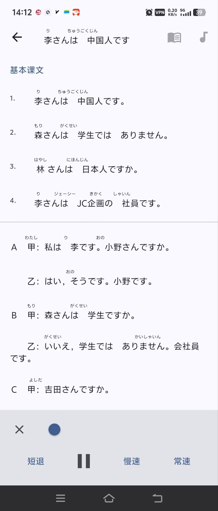

# 标日学习（Flutter 安卓客户端）

基于开源项目 **[冰河标日学习日志](https://github.com/wizicer/LearnJapan)**（《新版中日交流标准日本语》学习笔记、单词与语法）的 **Flutter 安卓应用**。将课文数据与朗读音频打包进应用，便于离线学习。

**English README: [README.md](README.md)**

---

## 功能概览

- **课程** — 初级 / 中级课文，支持假名标注 `!汉字(かな)` 与重音标记 `@`，以 HTML 形式渲染。
- **搜索** — 在本地数据中搜索单词与语法说明。
- **单词** — 按课背单词（翻卡）与单词详情：**逐词切片 MP3**（`assets/single_words/{okey}/XXXX.mp3`，由 `split_lesson_word_mp3.py` 生成）经 `just_audio` 播放；课文 / 整课单词 **内置 MP3** 亦由 `just_audio` 播放。
- **学习记录** — 「已记住」单词保存在本机（`SharedPreferences`）；设置页支持 **JSON 导出 / 导入**。
- **音频** — 课文与单词 MP3 来自上游仓库的 **gh-pages** 分支，应用内使用 **just_audio** 播放；资源位于 `assets/audio/`。

---

## 环境要求

- **Flutter** stable（与 `pubspec.yaml` 中 SDK 约束一致，当前为 ^3.11.1）
- **Dart**（随 Flutter 安装）
- **Android SDK**（本工程创建时仅启用 **Android** 平台；若需 iOS 可自行执行 `flutter create .` 补全）

---

## 快速开始

```bash
cd learn_japan_flutter
flutter pub get
```

### 1）生成课程数据（当你修改父目录 `_data/` 下的教材数据时）

在 `learn_japan_flutter/` 目录执行：

```bash
dart run tool/build_data.dart
```

会读取上一级仓库中的 `../_data/*.yml`、`../_data/*.csv`，生成 `assets/data/lessons_bundle.json`。

### 2）下载并打包音频（发布前建议执行）

```bash
dart run tool/fetch_audio.dart
```

从  
`https://raw.githubusercontent.com/wizicer/LearnJapan/gh-pages/assets/audio/`  
下载到 `assets/audio/lesson/` 与 `assets/audio/word/`。  
若需覆盖已有文件，可加参数：`dart run tool/fetch_audio.dart --force`。  
音频总体积约 **80MB 量级**，会明显增加 APK 体积。

#### 可选：从「整课单词 MP3」切出逐词音频（背词 / 单词详情仅播放此类切片）

整课文件如 `assets/audio/word/l1.mp3` 在静音处切开，与 `lessons_bundle.json` 中该课单词 **idx 顺序** 对齐，输出到 **`assets/single_words/l1/0001.mp3`** …（与 Piper 单课目录命名一致；需本机 **ffmpeg**）：

```bash
python tool/split_lesson_word_mp3.py --okey l1
```

对已下载的全部 `assets/audio/word/{okey}.mp3` 批量切分（无 mp3 的课会跳过）：

```bash
python tool/split_lesson_word_mp3.py --all --continue-on-error
```

若合并后有声段数仍与单词数不一致：有声段**多**时，前 N 个与词书 idx 对齐，**余段保留**，文件名从词书最大 idx+1 起四位续号（如 `0057.mp3`）；有声段**少**时仍截断词表只输出前若干词（见 stderr）。仍可调 `--merge-strategy` / `--merge-short`，或改用 `python tool/synth_audio_piper.py --single-words-lesson 1`。每课报告：`assets/single_words/{okey}/_split_report.csv`。

#### 可选：本机用 piper-plus 合成日语（无云）

依赖 **Python 3.11+** 与本机 `pip`：

```bash
pip install -r tool/requirements-piper.txt
python tool/synth_audio_piper.py --download-model
python tool/synth_audio_piper.py
```

首次 `--download-model` 会把 ONNX 存到 `tool/.piper_models/`（已加入 `.gitignore`）。默认模型为 **`ja_JP-css10-6lang-medium`**（日语向）；也可用 `PIPER_MODEL` / `PIPER_MODEL_DIR` 覆盖。试跑可加 `--only l1 --word-only`。  
生成 **WAV** 到 `assets/audio/word|lesson/<okey>.wav`。应用内课文页会依次尝试 **MP3 → WAV**；若只要 MP3，可在安装 **ffmpeg** 后加 **`--mp3`**。

词书「按课」合成到 **`assets/single_words/初级第01课/`**（或 **`中级第01课/`**），文件名 **`0001.wav`** 对应词条 `idx`（与 `lessons_bundle.json` 的 `words` 一致）：

```bash
python tool/synth_audio_piper.py --single-words-lesson 1
python tool/synth_audio_piper.py --single-words-lesson m1 --force
python tool/synth_audio_piper.py --single-words-lesson 1 --single-words-merge
```

`--single-words-all` 会处理全部课（耗时长）。`--single-words-merge` 依赖 **ffmpeg**，在该课目录下额外生成 **`本课全部词.wav`**。

若生成的 wav 在播放器里全是 **0:00**：多半是脚本误选了 `tool/.piper_models/*.cpu.opt.onnx`（与 `config.json` 不匹配会无声）。请**删掉**该目录下所有 `*.cpu.opt.onnx`，再执行 `python tool/synth_audio_piper.py --single-words-lesson 1 --force`。当前脚本已默认排除此类文件。

### 3）运行调试

```bash
flutter run
```

### 4）打包 APK

```bash
flutter build apk
```

产物位于 `build/app/outputs/flutter-apk/`，其中 **`app-release.apk`** 为发布构建；若曾执行 debug 构建，同目录还可能有 **`app-debug.apk`**。`.sha1` 文件为校验和，不是安装包。

---

## 目录结构说明

| 路径 | 说明 |
|------|------|
| `lib/main.dart` | 入口与底部导航（课程 / 搜索 / 单词 / 设置） |
| `lib/lesson_repository.dart` | 加载并格式化 `lessons_bundle.json`（逻辑对齐原 Ionic `items`） |
| `lib/japan_ruby.dart` | 假名标注与重音 → HTML（规则与原版 JS 一致） |
| `lib/pages/` | 各页面：课程列表、详情、搜索、背诵、设置 |
| `lib/pages/lesson_detail_shell.dart` | 课程详情页音频条（课文 / 单词内置音频播放） |
| `lib/recite_word_clip_path.dart` | 词目 `lesson` → `okey` 与 `assets/single_words/...` 切片路径（背词、单词详情） |
| `assets/data/lessons_bundle.json` | 构建生成的教材数据 |
| `assets/audio/lesson/`、`assets/audio/word/` | MP3，文件名为 `{okey}.mp3`（如 `l1`、`m12`，**l 为字母不是数字 1**） |
| `tool/build_data.dart` | 从 Jekyll `_data` 生成 `lessons_bundle.json` |
| `tool/fetch_audio.dart` | 从 GitHub `gh-pages` 拉取 MP3 |
| `tool/synth_audio_piper.py` | 本机 piper-plus：课文 okey 音频 / 词书按课 `single_words/`（见 `--single-words-*`） |
| `tool/split_lesson_word_mp3.py` | 将 `assets/audio/word/{okey}.mp3` 切成 `assets/single_words/{okey}/XXXX.mp3`；`--all` 批量处理 |

应用界面截图（缩略预览，原图见 [`说明/`](说明/) 目录）：






---

## 上游项目与许可

- **教材数据与原始站点**：[wizicer/LearnJapan](https://github.com/wizicer/LearnJapan)。  
- **音频**：`fetch_audio.dart` 使用的文件与上游 `gh-pages` 站点一致。  
- 上游为 **MIT License**；若二次分发请保留原作者版权与许可说明。

---


## 贡献

欢迎 Issue 与 PR；请尽量保持改动范围小、风格与现有代码一致。
